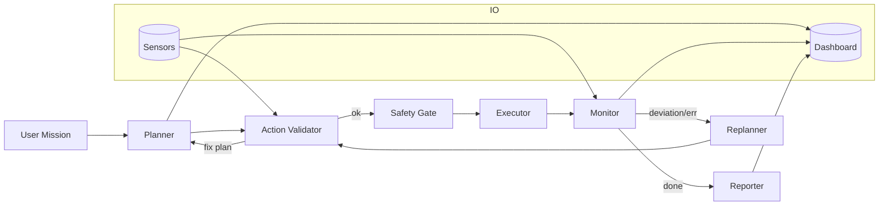

# PX4 Smart Agent — End‑to‑End Design

*A pragmatic, production‑ready blueprint with code, diagrams, and checklists*

> **Context**
> • PX4 on UAV, MAVSDK connection available (PX4 UDP `14540`, MAVSDK‑Server gRPC `50051`).
> • Vision pipeline (OAK‑D) already streams detections to JSON with `x,y,z` per object.
> • We’ll start with OpenAI ChatGPT API and keep the door open for an on‑device fallback.

---

## 0) TL;DR (What you’ll build)

**A ReAct‑style LangGraph agent** with extra safety nodes that:

1. parses natural language missions → **structured plan**,
2. **validates** each action against live **sensors**,
3. **executes** low‑level MAVSDK skills,
4. **replans** when reality deviates, and
5. **streams status** into a **Streamlit dashboard** with the live OAK‑D camera and telemetry.

**Key modules**

* `Planner` → `Validator` → `Safety Gate` → `Executor` → `Monitor` → `Replanner` → `Reporter`
* **Memory**: short‑term (per‑mission scratchpad) + long‑term (lessons learned & place safety geofences)
* **Skills**: reliable, unit‑tested wrappers over MAVSDK **Action/Offboard/Mission/Telemetry**

---

## 1) Agent Graph Selection — *ReAct++*

**Choose:** a **ReAct‑like** graph with **explicit safety & sensor nodes**. Pure ReAct is great, but we add guardrails around every motion.



**Why this graph?**

* **Planner** is LLM‑driven, but **Validator** enforces schemas, preconditions, and flight‑envelope limits.
* **Safety Gate** performs last‑millisecond checks (arming state, altitude, geofence, battery).
* **Monitor** watches *actual vs. expected*; **Replanner** corrects course with minimal drift.

---

## 2) Memory Mechanism — Short + Long

* **Short‑term memory (mission scratchpad)**: JSON state the graph passes along (plan, current step, last sensor snapshot, errors). Stored via LangGraph **checkpointing** (SQLite) to survive process restarts.
* **Long‑term memory** (optional at first): a small **mission log** (SQLite/JSONL) with:

  * environments (indoor/outdoor, GPS quality), known geofences, **battery profiles**, safe altitudes, prior failure fixes.
  * compressed **lessons learned** (LLM‑summarized) used as system context for the next missions.

**Retention rule of thumb**: keep every **incident** and **replan cause**, roll‑up to weekly summaries.

---

## 3) Model Choice (ChatGPT API)

**Recommended start:** `gpt‑5` (planner/critic) + `o4‑mini` (fast tool‑routing).

* `gpt‑5`: best for structured planning, coding‑level tool reasoning, and consistent JSON outputs.
* `o4‑mini`: cheap/quick for validation/tool call glue; escalates to `gpt‑5` on ambiguity.

> You can swap `gpt‑5` for `gpt‑4.1` if your account doesn’t have `gpt‑5` yet. Both support long contexts and solid tool calling.

**Tool calling**: use OpenAI Responses API with function (tool) schemas; the Planner emits a strict JSON plan. (We include a template in §6.)

---

## 4) PX4 Skill Management — Low vs. High Level

### 4.1 Low‑level skills (MAVSDK)

These are *atomic*, side‑effect‑checked operations. Each returns a **typed result** with `ok/err`, **preconditions**, **postconditions**, and **telemetry deltas** captured.

| Category      | Skill            | Args                            | Preconditions                 | Postconditions         | Notes                              |
| ------------- | ---------------- | ------------------------------- | ----------------------------- | ---------------------- | ---------------------------------- |
| Arm/Disarm    | `arm`            | –                               | safety checks pass            | vehicle armed          | reject if GPS required but missing |
|               | `disarm`         | –                               | landed & motors idle          | vehicle disarmed       | emergency override path            |
| Takeoff/Land  | `takeoff`        | `alt_m`                         | armed, posctl, airspace clear | altitude within ±0.5m  | auto sets yaw hold                 |
|               | `land`           | –                               | posctl                        | landed confirmed       | RTL fallback on failure            |
| Offboard Move | `move_ned`       | `north_m,east_m,down_m,yaw_deg` | offboard started              | position delta reached | clamps speed/acc/jerk              |
|               | `vel_ned`        | `vn,ve,vd,yaw_rate`             | offboard started              | speed reached/held     | time‑bounded                       |
|               | `hover`          | `sec`                           | posctl                        | stays within radius    | used for sensing                   |
| Heading       | `yaw_to`         | `deg`                           | posctl                        | yaw within tolerance   | rate‑limited                       |
| Mission       | `upload_mission` | `MissionPlan`                   | GPS lock                      | mission stored         | supports survey grid               |
|               | `start_mission`  | –                               | mission exists                | mission running        | monitor progress                   |
| Gimbal        | `gimbal_pitch`   | `deg`                           | gimbal connected              | angle set              | for imaging                        |
| Camera        | `photo_burst`    | `n`                             | storage ok                    | n frames saved         | tag with GPS/time                  |
| Telemetry     | `get_telemetry`  | fields set                      | –                             | snapshot returned      | used by Validator                  |

> **Local NED**: `x→North`, `y→East`, `z→Down` (so **down is positive**). Keep a tiny helper to convert between NED and ENU if you need it.

### 4.2 High‑level skills (composed)

| High‑level Skill         | What it does                                   | Built from low‑level                                            |
| ------------------------ | ---------------------------------------------- | --------------------------------------------------------------- |
| **Survey Grid (local)**  | Fly lawn‑mower in local NED around home        | `takeoff` → repeated `move_ned` cells → `photo_burst` → `land`  |
| **Geo Survey (global)**  | Convert polygon to lat/lon grid → upload → run | `upload_mission` → `start_mission`                              |
| **Object Sweep**         | 360° sweep + detect target + approach          | `takeoff` → `yaw_to`/`vel_ned` → vision checks → `move_ned`     |
| **Track & Follow**       | Follow a detected object at offset             | `vel_ned` loop with vision corrections                          |
| **Inspection Waypoints** | Fly named POIs with gimbal/camera plans        | `upload_mission` or `move_ned` + `gimbal_pitch` + `photo_burst` |
| **Perimeter Patrol**     | Trace rectangle and loiter at corners          | `move_ned` + `hover` + `yaw_to`                                 |
| **Search‑and‑Confirm**   | Pattern search; if found → close‑in & photo    | `Survey` + `Object Sweep` + `photo_burst`                       |

**Design note:** high‑level skills are **library functions** callable by the Planner *and* by the Replanner when it needs to patch gaps.

---

## 5) Sensor Integration (internal + vision)

**Best practice:** a thin **Sensor Broker** process that normalizes all sources to a shared **JSON contract**, then the agent consumes via **tools** (function calls) with **explicit field lists** (no free‑form file reads).

**Contract (example)**

```json
{
  "time": 1723270000,
  "telemetry": {
    "lat": 42.67, "lon": -83.20, "alt_m": 124.3,
    "rel_alt_m": 5.8, "vx": 0.2, "vy": 0.1, "vz": -0.1,
    "battery_pct": 81, "health": {"gps": true, "mag": true, "local_position": true}
  },
  "vision": {
    "objects": [
      {"label":"car","x":3.4, "y":-1.2, "z":-0.5, "conf":0.82},
      {"label":"person","x":6.1, "y":2.9, "z":-1.0, "conf":0.76}
    ]
  }
}
```

**LangGraph Tools**

* `get_sensor(fields:[str]) -> {field:value}` (fast key lookup)
* `nearest_object(label) -> {x,y,z,conf}`
* `telemetry_gate(requirements) -> {ok, why}` (battery>20%, gps ok, rel\_alt within bounds, geofence check)

> Keep the file on tmpfs or a small kv‑store (e.g., Redis) to avoid disk IO jitter; the Broker rewrites atomically.

---

## 6) Prompt Engineering (role, skills, examples)

We use **two prompts**: (A) Planner (big brain), (B) Validator (rubric‑driven tool router). Both expect/emit **JSON only**.

### (A) System Prompt — *Planner*

```
You are PX4 Planner. Goal: turn user text into a safe, efficient UAV plan.
Rules:
1) Always output JSON matching PlanSchema.
2) Prefer high‑level skills when they exist; otherwise compose low‑level skills.
3) Each step must include: goal, tool_name, args, success_criteria, max_duration_s, safety_checks.
4) Never assume sensors; call tools to check. Keep altitude in [3,60] m AGL unless the mission demands otherwise.
5) If inputs are ambiguous, add a first step "clarify" with questions; but proceed with a default assumption and bounds.
```

**`PlanSchema` (excerpt)**

```json
{
  "mission_name": "string",
  "assumptions": ["string"],
  "steps": [
    {
      "id": "s1",
      "goal": "e.g., get to survey altitude",
      "tool_name": "takeoff",
      "args": {"alt_m": 10},
      "success_criteria": "rel_alt within 10±0.5m",
      "max_duration_s": 30,
      "safety_checks": ["battery>25%","gps_ok==true"]
    }
  ]
}
```

**Few‑shot**

* *User*: "Do a 30×20 m survey at 8 m and take photos every 5 m."
* *Planner JSON*: steps: `arm`→`takeoff(8)`→`survey_grid(width=30,length=20,cell=5,alt=8,photo_every=5)`→`land`.

### (B) System Prompt — *Validator*

```
You are PX4 Validator. Input: Plan JSON. Task: (1) verify schema; (2) insert missing safety checks; (3) replace free‑move loops with a known high‑level skill if available; (4) emit FinalPlan JSON or a list of corrections.
```

---

## 7) Nodes and State — *Message types & contracts*

```mermaid
classDiagram
class AgentState {
  mission_text: str
  plan: Plan
  cursor: int
  last_result: dict
  sensors: dict
  incidents: Incident[]
  status: str
}
class Incident {
  time: int
  kind: {WARN,ERROR}
  who: {Validator,Executor,Monitor}
  msg: str
}
```

**Node responsibilities**

* **Planner** → generate `plan` (JSON)
* **Action Validator** → enforce schema, add checks
* **Safety Gate** → live `telemetry_gate` before each step
* **Executor** → call MAVSDK skill, emit `last_result`
* **Monitor** → compare expected vs. actual; push `Incident`s; decide done/continue
* **Replanner** → patch steps or switch to a high‑level skill
* **Reporter** → stream to UI & persist mission log

---

## 8) PX4 Mission Management — *Validation, Replanning, Error Paths*

**Per‑step lifecycle**

```mermaid
sequenceDiagram
  participant V as Validator
  participant G as Safety Gate
  participant X as Executor
  participant M as Monitor
  V->>G: preconditions OK?
  G-->>V: ok / why_not
  V->>X: run(tool,args)
  X-->>M: result (ok, metrics)
  M-->>V: meets success_criteria?
  alt M-->>R: no → Replanner patch step
  M-->>UI: status update
```

**Error handling table**

| Error              | Detected by | Primary response                | Secondary                     |
| ------------------ | ----------- | ------------------------------- | ----------------------------- |
| Low battery        | Safety Gate | land/RTL immediately            | notify & mark incident        |
| GPS lost           | Monitor     | switch to local NED hover, hold | attempt re‑acquire, then land |
| Offboard reject    | Executor    | retry (3) with backoff          | fallback to `position_hold`   |
| Plan drift (>2m)   | Monitor     | micro‑replan with `move_ned`    | expand tolerance or abort     |
| Vision target lost | Monitor     | widen sweep arc                 | switch to grid search         |

**Gantt (example: 30×20 m local survey)**

```mermaid
gantt
  title Survey (local NED)
  dateFormat  X
  section Flight
  Arm & checks        :a1, 0, 5
  Takeoff to 8m       :a2, 5, 15
  Grid (6 cells)      :a3, 15, 120
  Land                :a4, 120, 150
  section Sensing
  Cam warmup          :s1, 0, 8
  Photo every 5m      :s2, 20, 120
```



---

## 9) Dashboard (Streamlit) — Live camera + sensors + agent control

**Goals**

* Live **OAK‑D** RGB preview
* **Telemetry** cards (alt/battery/GPS) & charts
* Mission **prompt box** + streaming logs
* **Start/Abort** buttons

> The app runs **on the Jetson** beside MAVSDK‑Server. For production, split camera streaming (DepthAI → MJPEG) from UI using a tiny WebSocket server.

---

# IMPLEMENTATION — Code you can start from

*(All snippets are minimal but production‑grade; add retries and logging as noted.)*

## A) MAVSDK skill wrappers (`mavsdk_skills.py`)

```python
import asyncio
from dataclasses import dataclass
from typing import Optional, Tuple, Dict, Any
from mavsdk import System
from mavsdk.offboard import (OffboardError, PositionNedYaw, VelocityNedYaw)

@dataclass
class SkillResult:
    ok: bool
    msg: str = ""
    data: Dict[str, Any] = None

class Drone:
    def __init__(self, server_addr: str = "127.0.0.1", port: int = 50051):
        self.drone = System(mavsdk_server_address=server_addr, port=port)

    async def connect(self, system_addr: Optional[str] = None):
        await self.drone.connect(system_address=system_addr)  # e.g. "udp://:14540"
        async for state in self.drone.core.connection_state():
            if state.is_connected:
                return SkillResult(True, "Connected")
        return SkillResult(False, "Timeout waiting for connection")

    async def arm(self):
        await self.drone.action.arm()
        return SkillResult(True, "Armed")

    async def disarm(self):
        await self.drone.action.disarm()
        return SkillResult(True, "Disarmed")

    async def takeoff(self, alt_m: float = 10.0):
        await self.drone.action.set_takeoff_altitude(alt_m)
        await self.drone.action.takeoff()
        # wait until near target altitude
        async for pos in self.drone.telemetry.position():
            if pos.relative_altitude_m is not None and abs(pos.relative_altitude_m - alt_m) < 0.6:
                break
        return SkillResult(True, f"Reached {alt_m:.1f} m")

    async def land(self):
        await self.drone.action.land()
        # wait until landed
        async for in_air in self.drone.telemetry.in_air():
            if not in_air:
                break
        return SkillResult(True, "Landed")

    async def start_offboard(self):
        # Send initial setpoint before starting offboard
        await self.drone.offboard.set_position_ned(PositionNedYaw(0.0, 0.0, 0.0, 0.0))
        try:
            await self.drone.offboard.start()
            return SkillResult(True, "Offboard started")
        except OffboardError as e:
            return SkillResult(False, f"Offboard start failed: {e}")

    async def stop_offboard(self):
        try:
            await self.drone.offboard.stop()
        except OffboardError:
            pass
        return SkillResult(True, "Offboard stopped")

    async def move_ned(self, north: float, east: float, down: float, yaw_deg: float, tolerance_m: float = 0.5):
        # relative step in NED
        # read current local position (NED origin assumed at arming)
        start_n, start_e, start_d = 0.0, 0.0, 0.0
        # Many setups lack absolute NED; we drive by *relative* setpoints and time budget
        await self.drone.offboard.set_position_ned(PositionNedYaw(north, east, down, yaw_deg))
        # crude settle wait
        await asyncio.sleep(max(2.0, min(10.0, (abs(north)+abs(east)+abs(down)) / 1.0)))
        return SkillResult(True, "Move complete", {"ned": (north, east, down), "yaw": yaw_deg})

    async def yaw_to(self, yaw_deg: float):
        await self.drone.offboard.set_position_ned(PositionNedYaw(0.0, 0.0, 0.0, yaw_deg))
        await asyncio.sleep(1.0)
        return SkillResult(True, f"Yaw {yaw_deg:.1f}")

    async def telemetry_snapshot(self) -> Dict[str, Any]:
        snap = {}
        async for b in self.drone.telemetry.battery():
            snap["battery_pct"] = b.remaining_percent * 100.0
            break
        async for pos in self.drone.telemetry.position():
            snap["rel_alt_m"] = pos.relative_altitude_m
            snap["lat"] = pos.latitude_deg
            snap["lon"] = pos.longitude_deg
            break
        async for h in self.drone.telemetry.health():
            snap["gps_ok"] = h.is_global_position_ok
            snap["local_pos_ok"] = h.is_local_position_ok
            break
        return snap
```

> **Why not exact distance verification?** On many PX4 builds, local NED isn’t globally referenced. For precise distance, integrate **flow/visual odometry** or compare GPS deltas; the `Monitor` node handles this.

---

## B) Sensor tools (LangGraph) — `sensor_tools.py`

```python
import json, time, os
from typing import Dict, Any, List

SENSOR_PATH = os.getenv("SENSOR_JSON", "./data/sensors.json")

def _load() -> Dict[str, Any]:
    with open(SENSOR_PATH, "r") as f:
        return json.load(f)

def get_sensor(fields: List[str]) -> Dict[str, Any]:
    data = _load()
    out = {}
    for f in fields:
        cursor = data
        for k in f.split('.'): cursor = cursor.get(k, {})
        out[f] = cursor if cursor != {} else None
    return out

def nearest_object(label: str) -> Dict[str, Any]:
    data = _load()
    objs = [o for o in data.get("vision",{}).get("objects",[]) if o.get("label") == label]
    if not objs: return {"found": False}
    # nearest by Euclidean in NED
    obj = min(objs, key=lambda o: (o["x"])**2 + (o["y"])**2 + (o["z"])**2)
    return {"found": True, **obj}

def telemetry_gate(requirements: Dict[str, Any]) -> Dict[str, Any]:
    s = _load()["telemetry"]
    ok = True; why = []
    if requirements.get("battery_min_pct") and s.get("battery_pct",0) < requirements["battery_min_pct"]:
        ok = False; why.append("battery low")
    if requirements.get("gps_required") and not s.get("health",{}).get("gps", False):
        ok = False; why.append("gps not ok")
    if limits := requirements.get("rel_alt_bounds_m"):
        ra = s.get("rel_alt_m", 0)
        if not (limits[0] <= ra <= limits[1]):
            ok = False; why.append("rel_alt out of bounds")
    return {"ok": ok, "why": "; ".join(why)}
```

---

## C) LangGraph wiring — `agent_graph.py`

```python
from typing import Literal, List, Dict, Any
from pydantic import BaseModel, Field
from langgraph.graph import StateGraph, END
from langgraph.checkpoint.sqlite import SqliteSaver
from openai import OpenAI

from mavsdk_skills import Drone
from sensor_tools import get_sensor, nearest_object, telemetry_gate

client = OpenAI()

actions = {
  "get_sensor": get_sensor,
  "nearest_object": nearest_object,
  "telemetry_gate": telemetry_gate,
}

class Step(BaseModel):
    id: str
    goal: str
    tool_name: str
    args: Dict[str, Any]
    success_criteria: str
    max_duration_s: int = 30

class Plan(BaseModel):
    mission_name: str
    steps: List[Step]

class AgentState(BaseModel):
    mission_text: str
    plan: Plan | None = None
    cursor: int = 0
    last_result: Dict[str, Any] = {}
    sensors: Dict[str, Any] = {}
    status: str = "init"

async def node_planner(state: AgentState) -> AgentState:
    # Call GPT Planner (function calling to emit Plan)
    sys = "You are PX4 Planner. Output strictly Plan JSON."
    tools = [{
        "type": "function",
        "function": {
          "name": "emit_plan",
          "description": "Return Plan JSON",
          "parameters": Plan.model_json_schema()
        }
    }]
    msg = client.responses.create(
        model="gpt-5",
        input=[{"role":"system","content":sys},{"role":"user","content":state.mission_text}],
        tools=tools,
        tool_choice={"type":"function","function":{"name":"emit_plan"}}
    )
    tool_out = msg.output[0].content[0].input  # Responses API function output
    state.plan = Plan(**tool_out)
    state.status = "planned"
    return state

async def node_validate(state: AgentState) -> AgentState:
    # Example: force battery check on every step
    for s in state.plan.steps:
        if s.tool_name in ("takeoff","move_ned","vel_ned","start_mission"):
            gate = telemetry_gate({"battery_min_pct": 25, "gps_required": True})
            if not gate["ok"]:
                state.status = f"blocked:{gate['why']}"; return state
    state.status = "validated"; return state

async def node_execute(state: AgentState) -> AgentState:
    drone = Drone(port=50051)
    await drone.connect()
    step = state.plan.steps[state.cursor]
    # dispatch
    if step.tool_name == "arm": res = await drone.arm()
    elif step.tool_name == "takeoff": res = await drone.takeoff(**step.args)
    elif step.tool_name == "land": res = await drone.land()
    elif step.tool_name == "start_offboard": res = await drone.start_offboard()
    elif step.tool_name == "stop_offboard": res = await drone.stop_offboard()
    elif step.tool_name == "move_ned": res = await drone.move_ned(**step.args)
    elif step.tool_name == "yaw_to": res = await drone.yaw_to(**step.args)
    else:
        res = {"ok": False, "msg": f"unknown tool {step.tool_name}"}
    state.last_result = res.__dict__ if hasattr(res, "__dict__") else res
    state.status = "executed"
    return state

async def node_monitor(state: AgentState) -> AgentState:
    # toy check: if last_result.ok then advance
    if state.last_result.get("ok"):
        state.cursor += 1
        state.status = "next" if state.cursor < len(state.plan.steps) else "done"
    else:
        state.status = "needs_replan"
    return state

async def node_replan(state: AgentState) -> AgentState:
    # Simple: ask LLM to patch remaining steps
    remaining = state.plan.steps[state.cursor:]
    prompt = f"Fix these steps given error {state.last_result}: {remaining}"
    state.mission_text = prompt
    return await node_planner(state)

# Graph wiring
builder = StateGraph(AgentState)
builder.add_node("planner", node_planner)
builder.add_node("validate", node_validate)
builder.add_node("execute", node_execute)
builder.add_node("monitor", node_monitor)
builder.add_node("replan", node_replan)

builder.set_entry_point("planner")
builder.add_edge("planner", "validate")
builder.add_edge("validate", "execute")
builder.add_edge("execute", "monitor")
builder.add_conditional_edges("monitor", lambda s: s.status, {
    "next": "execute",
    "needs_replan": "replan",
    "done": END
})

memory = SqliteSaver.from_file_path("./.agent_ckpt.sqlite")
app = builder.compile(checkpointer=memory)
```

---

## D) High‑level skill: Local Survey Grid (`survey_local.py`)

```python
from typing import List, Tuple
from mavsdk_skills import Drone, SkillResult
import asyncio

async def survey_local(width_m: float, length_m: float, cell_m: float, alt_m: float = 8.0) -> SkillResult:
    d = Drone(port=50051)
    await d.connect()
    await d.arm()
    await d.takeoff(alt_m)
    await d.start_offboard()

    rows = int(length_m // cell_m)
    cols = int(width_m // cell_m)
    north = 0.0; east = 0.0; down = -alt_m  # z down positive: hold -alt_m as setpoint depth

    # snake pattern (lawn‑mower)
    for r in range(rows):
        # traverse across width
        target_e = (cols * cell_m) if (r % 2 == 0) else 0.0
        await d.move_ned(north, target_e, down, yaw_deg=0.0)
        # step one row north
        north += cell_m
        await d.move_ned(north, target_e, down, yaw_deg=0.0)

    await d.stop_offboard()
    await d.land()
    return SkillResult(True, "Survey done")

if __name__ == "__main__":
    asyncio.run(survey_local(30, 20, 5, 8))
```

> For **outdoor global surveys**, prefer `Mission` plugin with lat/lon waypoints and camera triggers.

---

## E) Streamlit Dashboard (`app.py`)

```python
import os, time, json, threading
import streamlit as st
import websocket
from pathlib import Path

SENSOR_JSON = Path(os.getenv("SENSOR_JSON", "./data/sensors.json"))
CAM_USE_DEPTHAI = os.getenv("CAM_USE_DEPTHAI", "1") == "1"

st.set_page_config(page_title="PX4 Smart Agent", layout="wide")
st.title("PX4 Smart Agent Dashboard")

# --- Left: Camera ---
cam_col, info_col = st.columns([2,1])
with cam_col:
    st.subheader("Live Camera (OAK‑D)")
    frame = st.empty()
    run = st.checkbox("Start Camera", value=False)
    if run and CAM_USE_DEPTHAI:
        import depthai as dai
        pipeline = dai.Pipeline()
        cam = pipeline.create(dai.node.ColorCamera)
        xout = pipeline.create(dai.node.XLinkOut); xout.setStreamName("rgb")
        cam.setPreviewSize(640, 360); cam.setFps(30); cam.setInterleaved(False)
        cam.preview.link(xout.input)
        with dai.Device(pipeline) as device:
            q = device.getOutputQueue(name="rgb", maxSize=4, blocking=False)
            while run and (img := q.tryGet()) is not None:
                frame.image(img.getCvFrame(), channels="BGR")
                run = st.session_state.get("_run_cam", True)

# --- Right: Telemetry cards ---
with info_col:
    st.subheader("Telemetry")
    telem = st.empty()
    def read_sensor():
        try: return json.loads(SENSOR_JSON.read_text())
        except: return {}
    s = read_sensor().get("telemetry", {})
    st.metric("Rel Alt (m)", s.get("rel_alt_m", "-"))
    st.metric("Battery %", s.get("battery_pct", "-"))
    st.metric("GPS OK", s.get("health",{}).get("gps", False))

st.divider()

# --- Mission control ---
st.subheader("Mission Control")
mission = st.text_area("Type a mission (e.g., 'Survey 30x20m at 8m, photo every 5m'):")
colA, colB = st.columns(2)
log = st.empty()

AGENT_WS = os.getenv("AGENT_WS", "ws://127.0.0.1:8765")

def stream_agent(msg):
    ws = websocket.create_connection(AGENT_WS)
    ws.send(json.dumps({"mission": msg}))
    while True:
        m = ws.recv()
        log.write(m)
        if m.endswith("__END__"): break
    ws.close()

if colA.button("Run Mission"):
    threading.Thread(target=stream_agent, args=(mission,), daemon=True).start()

if colB.button("Abort"):
    # send abort to agent WS server (implement server to listen for it)
    pass
```

> For remote viewing, place the DepthAI loop in a **separate process** and stream MJPEG over WebSocket/RTSP so the UI stays snappy.

---

## F) Checklists & Guardrails

**Pre‑flight**

* [ ] Sensors nominal (GPS/local pos, mag, baro)
* [ ] Battery ≥ 30% (≥ 50% for long missions)
* [ ] Geofence loaded
* [ ] `RTL` configured and tested

**Per‑step**

* [ ] Preconditions satisfied (`telemetry_gate`)
* [ ] Timeout set (`max_duration_s`)
* [ ] Success criteria measurable (alt/distance/photo count)

**Incident policy**

* *Low battery or link loss* → **Immediate land/RTL**
* *Plan drift* → micro‑replan once, then abort

---

## G) Extending to On‑Device (Local LLM)

* Use a distilled planner (e.g., 7–13B) fine‑tuned on **mission→plan** JSON pairs.
* Keep Validator in the cloud initially for robust tool schemas.
* Cache successful plans & patches; compile into few‑shot prompts for the local model.

---

## 10) Example: End‑to‑End Mission

**User**: *"Find a person. If you see one, approach to 3 m and take 3 photos, then land."*

1. Planner → steps: `arm` → `takeoff(10)` → `object_sweep(label=person, arc=360)` → `approach(x=3m)` → `photo_burst(3)` → `land`
2. Validator → inserts battery≥35%, min altitude 8 m, max speed 3 m/s
3. Executor → runs skills
4. Monitor → confirms detections & distance
5. Replanner → widens sweep if target lost
6. Reporter → dashboard stream + mission log

---

## 11) What to build next

* **Unit tests** that replay sensor logs to validate Validator/Replanner logic.
* **Formal success metrics** (coverage %, photo count, deviation m).
* **Geo survey** mission builder with polygon import (KML/GeoJSON).
* **Safety sandbox**: SITL + Gazebo with synthetic OAK‑D detections.

---

### Appendix — Notes on Coordinates

* **Local NED** (PX4): +X North, +Y East, +Z Down.
* **ENU** (ROS): +X East, +Y North, +Z Up.
* Be consistent; provide converters in the `Sensor Broker` where needed.
